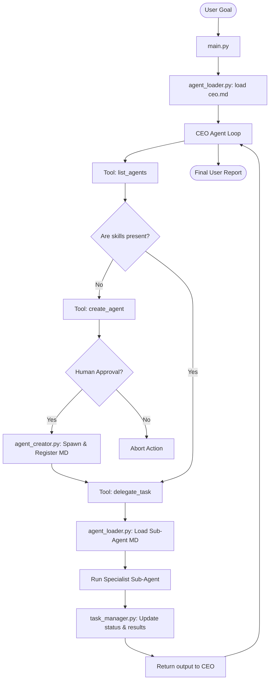

# NovaEdge Build - AI Workforce Platform

**NovaEdge Build** is an autonomous multi-agent operational platform designed for **NovaEdge Digital Labs**. Unlike basic chat systems, NovaEdge Build acts as an agentic operating system where a central **CEO Agent** manages, delegates to, coordinates with, and dynamically spawns specialized sub-agents to achieve user-defined software company goals.

---

## 📂 Project Structure

```bash
novaedge-build/
│
├── agents/                      # Markdown-based agent profiles
│   ├── templates/               # Reusable templates for new agents
│   │   └── agent_template.md    # Template for creating new agents
│   ├── ceo.md                   # Central orchestrator agent
│   ├── seo_agent.md             # Specialist search engine optimizer agent
│   ├── social_media_agent.md    # Specialist marketing and content agent
│   └── website_agent.md         # Specialist frontend and UX agent
│
├── configs/                     # Registry logs and persistent settings
│   └── agents_registry.json     # Tracks status and roles of all agents
│
├── memory/                      # Task tracking and session persistence
│   └── tasks.json               # Current execution states and results
│
├── tools/                       # Custom python-based tool extensions
├── workflows/                   # Pre-defined agent-interaction templates
├── logs/                        # Detailed execution and error records
├── runtime/                     # Sandbox execution space for dynamic code
│
├── main.py                      # Main entrypoint and console command loop
├── agent_loader.py              # Dynamic parser for markdown frontmatter/body
├── agent_creator.py             # Spawns, saves, and registers new agents
├── task_manager.py              # Creation, tracking, and dependency resolution of tasks
│
├── requirements.txt             # Project library dependencies
└── .env                         # Environment keys and configurations
```

---

## 🤖 How the Agents Work

NovaEdge Build is built on a **hierarchical multi-agent framework**:
1. **The CEO Agent** is the brain of the platform. It takes the high-level request, evaluates the workforce capabilities, plans the task breakdown, and directs specialized agents.
2. **Specialized Agents** (SEO, Social Media, Website, etc.) are focused specialists designed for high proficiency in narrow domains. They run actions and return standardized output reports back to the CEO.
3. **The Task Manager** maintains a persistent record of all tasks and their states (`pending`, `in_progress`, `completed`, `failed`). It supports a dependency model (DAGs), ensuring sub-tasks are only launched when their prerequisite tasks are successfully executed.
4. **Human-in-the-Loop Safeguards** protect the host machine by requesting approval via terminal command prompts for high-risk operations (such as spawning new agents or writing/editing critical project files).

---

## 📄 Markdown-Based Agents

Agents are designed using clean, human-readable **Markdown profiles**. This allows engineers, project managers, and even other AI models to easily inspect, modify, and manage agent definitions.

Each agent file contains:
- **YAML Frontmatter (`---`)**: Declarative metadata defining name, role, goals list, rules constraints, and available tools.
- **Markdown Body (`# Role Definition...`)**: Structured details detailing instructions, responsibilities, and procedural workflows.

### Example Markdown Structure
```markdown
---
name: SEOAgent
role: Search Engine Optimization Specialist Agent
goals:
  - Maximize organic search visibility for products.
tools:
  - analyze_keywords
  - audit_page_seo
rules:
  - Follow ethical white-hat guidelines.
---

# SEO Specialist Agent
## Role Definition
...
```

---

## 🛠️ Dynamic Agent Creation

When the CEO Agent determines that a user's task requires a skill set that is not met by any existing agent:
1. **Spawn Decision**: The CEO Agent calls the `create_agent` tool.
2. **Profile Generation**: The CEO formats the role, goals, rules, and workflows into a clean markdown document.
3. **Disk Persistence**: `AgentCreator` automatically saves this file (e.g. `databaseagent.md`) inside the `agents/` directory.
4. **Registry Registration**: The new agent is automatically written to `configs/agents_registry.json` and becomes immediately available to load dynamically.

---

## 🚀 Execution Flow



---

## ⚡ Future Scalability

NovaEdge Build is ready to scale into a enterprise-grade autonomous operating system:
1. **Web Dashboard Integration**: The file-based JSON storage in `memory/tasks.json` and `configs/agents_registry.json` can be easily read and served by a lightweight FastAPI or Next.js server to build a live visual monitoring GUI.
2. **Vector Database Memory**: Integrating ChromaDB or SQLite-VSS inside the `memory/` folder will allow agents to store semantic embeddings of past execution logs, enabling long-term cross-session knowledge.
3. **Secure Sandboxing**: Executing agent-generated code inside isolated Docker or WebAssembly runtimes inside the `runtime/` folder.
4. **Agent-to-Agent Communication**: Extending the Task Manager DAG to support asynchronous message queue routing (RabbitMQ/Redis) so agents can trigger events and messages amongst themselves directly.

---

## 💻 Getting Started

### Prerequisites
- Python 3.8+
- OpenAI API Key (optional; fallback Simulation Mode provided)

### Setup & Run
1. Install dependencies:
   ```bash
   pip install -r requirements.txt
   ```
2. Configure environment variables (optional):
   Rename `.env` or edit the API key:
   ```env
   OPENAI_API_KEY=your-actual-api-key
   OPENAI_MODEL=gpt-4o
   ```
3. Run the orchestrator:
   ```bash
   python main.py
   ```
