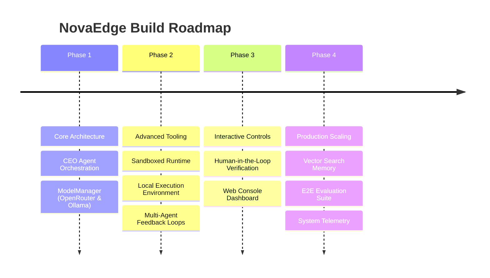

# NovaEdge Build - Roadmap

This roadmap outlines the milestones, planned enhancements, and vision for the NovaEdge Build multi-agent orchestration platform.

---

## 🗺️ Execution Timeline

---

## 🚀 Phase 1: Core Architecture & Modular Inference (Completed)
- [x] **Modular Model Architecture:** Integrated a centralized `ModelManager` supporting multiple model providers (OpenRouter & local Ollama daemon) with automatic validation and fallback routing.
- [x] **Hierarchical Orchestration:** Implemented a CEO Agent that parses objectives, constructs execution plans, registers and spawns specialized sub-agents.
- [x] **Stateful Task Management:** Created a persistent `TaskManager` to log execution status, track dependency trees, and output execution logs.
- [x] **Mock & Simulation Capabilities:** Enabled full simulation mode when no active LLM provider endpoints are accessible.

---

## 🛠️ Phase 2: Advanced Tool Integration & Runtime Environments (Q3 2026)
- [ ] **Sandboxed Runtime Execution:**
  - Launch isolated dockerized runtime containers for executing agent-generated scripts and building frontend files securely.
  - Implement sandbox telemetry (execution duration, RAM, CPU limits).
- [ ] **Rich Tool APIs:**
  - Connect standard web search tools, scrapers, and document converters.
  - Integrate database agents (MongoDB/Supabase connectors) to let specialized agents manipulate structured schemas.
- [ ] **Multi-Agent Collaborative Loops:**
  - Build cross-agent code reviews (e.g., SEO Agent reviews Website Agent output before finalizing).
  - Implement self-healing loops where execution errors in the runtime are sent back to agents for automated debugging.

---

## 👥 Phase 3: Interactive Controls & Human-in-the-Loop (Q4 2026)
- [ ] **Human-in-the-Loop (HITL) Gateways:**
  - Add explicit approval gates for high-risk tools (file mutations, SSH access, API deployments).
  - Enable interactive terminal prompts when agent confidence falls below a configured threshold.
- [ ] **Web Console & Dashboard:**
  - Create a modern, responsive React/Next.js interface to visualize agent trees, task execution states, and system outputs.
  - Display live log streams and token consumption graphs per agent.
- [ ] **Advanced Context Management:**
  - Integrate Vector Database (e.g., ChromaDB or pgvector) for long-term agent memory.
  - Implement semantic search over past task outcomes.

---

## 📈 Phase 4: Production Scaling & Analytics (Q1 2027)
- [ ] **E2E Evaluation Suite:**
  - Implement automated LLM-as-a-judge tests to evaluate orchestration reliability.
  - Monitor plan deviation and rate task completion efficacy.
- [ ] **Resource Optimization:**
  - Incorporate smart prompt caching to reduce token overhead.
  - Dynamically route cheaper, faster models (e.g., Gemini Flash, DeepSeek-Lite) for trivial routing tasks, and reserve advanced models for reasoning.
- [ ] **System Telemetry:**
  - Export OpenTelemetry metrics for latency tracing.
  - Connect structured JSON logs to standard visualization tools (e.g., ELK stack, Datadog).
